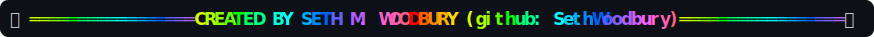

# 🌈 beautiful fun claude (bfc)

A gorgeous, ridiculous, **fun** status line for [Claude Code](https://code.claude.com/docs/en/statusline) — a calm, colorful info bar most of the time, with periodic full‑width **animated cameos** (a wizard battle, races with photo finishes and wipeouts, a hyperdrive jump, a matrix‑style decrypt, a llama spitting, a T‑rex who can't reach the snack, a self‑destruct that just says "jk", nyan‑cat, fireworks, and more — **36 in all**).


Every ~20 seconds the whole bar briefly turns into a full‑width animation — the signature wizard‑battle's energy clash, and 30+ more:




<sub>(GitHub can't show ANSI color in a code block, so these are SVG snapshots of real output — on your machine the colors are live and the cameos animate.)</sub>

It runs **locally** and uses **zero API tokens / zero context** — it's just a shell script Claude Code pipes session JSON to.

**▶ See them move (GIFs):** [a full cameo, start to finish (`computa`)](#a-full-animation-start-to-finish-computa) · [a gallery of cameos (warp, race, fight, duel…)](#a-few-more-cameos) — or skip ahead to [**installing it** (incl. a copy‑paste Claude prompt)](#install).

---

## What the bar shows

| Segment | Meaning |
|---|---|
| 🦌 mascot | Stable per‑session emoji (same session = same critter; handy in `/resume`). |
| `─── … ───` | White→blue end‑caps (white points inward). Toggle `SHOW_DECO`. |
| `[name]` | Session name (snake‑cased, shortened). |
| `📁 dir` | Current folder, or `owner/repo` in a git repo. |
| `Opus 4.8 1M·xhigh` | Model + reasoning effort. |
| `ctx ▓▓░░ 67% · 670k/1M` | Context fuel gauge + token headroom. |
| `↑1903 ↓382` | Lines added / removed. |
| `◷ May 30 2:47p` | Session start time (cached). |
| `5h 10% → … · 7d 11%` | Subscription rate‑limit windows (or `◆ api $X.XX` on API billing). |
| `· small diffs win` | A rotating quip. |

Colors are role‑based: grey = info, teal = your name, warm ramp = anything that "fills up."

## A full animation, start to finish (`computa`)

In context — your normal status bar, a cameo taking over for a few seconds, then back to the bar (exactly how it behaves live):


And the cameo on its own — the wholesome word and the 2/3‑syllable word are random each run, and flash color as it holds:


Beat by beat (each holds ~1 second):


Watch any of them live with `test-animations computa` (bar‑accurate) or `test-animations-fast computa` (smooth). The GIF was generated with `tools/make-gif.sh computa` (see `tools/` for the ANSI→SVG/PNG renderers).

## A few more cameos

A handful of the showier ones — all randomized, so outcomes vary every run:

**`warp`** — a hyperdrive jump


**`duel`** — a high‑noon standoff (sometimes a double K.O.)


**`race`** — two racers: lead changes, photo finishes, the occasional wipeout


**`fight`** — a brawl that ends in a random K.O.


**`seth`** — a hidden wizard‑battle reel


## Dependencies

- **bash 4+**
- **[jq](https://jqlang.github.io/jq/)** (required — JSON parsing)
- **coreutils** `date` / `stat` — works with GNU (Linux) **or** BSD/macOS variants
- A terminal with **256‑color** support (almost all modern ones)
- *Optional:* a `claude-limit` CLI on `PATH` enables a rate‑limit‑recovery hint (auto‑hidden if absent)

> **macOS:** the system `bash` is 3.2 — too old (the scripts use bash‑4 namerefs/`readarray`). Install a modern one: `brew install bash` (and ensure it's used). `jq`: `brew install jq`.

## Install

```bash
git clone https://github.com/SethWoodbury/beautiful_fun_claude.git
cd beautiful_fun_claude
./install.sh
```

`install.sh` copies `statusline.sh` + `statusline-animations.sh` to `~/.claude/`, the preview tools to `~/.local/bin/`, makes them executable, and merges this into `~/.claude/settings.json` (backing it up first):

```json
{
  "statusLine": { "type": "command", "command": "~/.claude/statusline.sh", "refreshInterval": 1 }
}
```

> **`refreshInterval: 1`** makes the bar repaint ~once a second so the periodic animation cameos can actually move. Prefer a calmer bar? Set it to `60` (the cameos then won't animate), or turn cameos off entirely with `ANIM_ENABLED=0` near the top of `statusline.sh`.

Changes appear on your next interaction with Claude Code. Then:

```bash
test-animations            # preview the animations exactly as the bar shows them
test-animations seth        # just one (run a few times — they're randomized)
test-animations --list      # all animation names    (--help for usage)
test-animations-fast         # smooth, full-fps preview  (test-animations-fast loop = run forever)
```

## Turn animations on/off, pick favorites, change speed

A small `bfc` command (installed to `~/.local/bin`) edits the config for you — no file‑editing needed. Changes take effect on your next interaction with Claude Code.

```bash
bfc off                       # turn the in-bar cameos OFF
bfc on                        # ...and back ON
bfc every 60                  # one cameo per 60 seconds (default 20)
bfc frames 6                  # shorter/snappier cameos (~6s; default 10)
bfc only seth race fish       # play ONLY these animations
bfc exclude duel selfdestruct # drop a few from the rotation
bfc add warp helix            # add some back
bfc all                       # rotate through every animation
bfc                           # show current settings   (bfc list = all names; bfc --help)
```

Prefer editing by hand? The same knobs live in the **CONFIG** block at the top of `~/.claude/statusline.sh` (`ANIM_ENABLED`, `ANIM_EVERY`, `ANIM_FRAMES`, `ANIM_STYLES`).

### 🤖 Install with Claude (copy‑paste prompt)

Paste this into a Claude Code session and it'll do the whole install:

> Please install the **beautiful_fun_claude** Claude Code status line for me from `https://github.com/SethWoodbury/beautiful_fun_claude`.
> Steps: (1) make sure `jq` is installed (it's required); (2) `git clone` that repo to a temp dir and run its `./install.sh` — which copies `statusline.sh`, `statusline-animations.sh`, and `subagent-statusline.sh` into `~/.claude/`, copies the `bfc`, `test-animations`, and `test-animations-fast` tools into `~/.local/bin/`, makes them executable, and **merges** (does not overwrite) this into my `~/.claude/settings.json`: `"statusLine": {"type":"command","command":"~/.claude/statusline.sh","refreshInterval":1}`; (3) confirm `~/.local/bin` is on my `PATH`; (4) tell me to run `test-animations` in a terminal to preview, and that the status bar updates on my next message. Note: `refreshInterval:1` repaints the bar every second so the occasional animation cameos can move — mention I can run `bfc off` to disable cameos, `bfc every 60` to slow them down, or `bfc only <names>` to pick favorites (`bfc --help`). Optionally I can set `SIG_NAME`/`SIG_GH` in `~/.claude/statusline-animations.sh` to put my own name in the `credits` animation, and I can enable themed subagent rows by adding `"subagentStatusLine": {"type":"command","command":"~/.claude/subagent-statusline.sh"}` to settings.json. Don't change any other settings of mine.

## Configuration

Everything lives in the **CONFIG** and **PALETTE** blocks at the top of `~/.claude/statusline.sh`:

| Knob | Default | Notes |
|---|---|---|
| `ANIM_ENABLED` | `1` | Master on/off for in‑bar cameos. |
| `ANIM_EVERY` | `20` | Seconds between cameos (a cameo plays once per window). |
| `ANIM_FRAMES` | `10` | Length of a cameo in ~1s frames (`credits`→14s, `seth`→18s). |
| `ANIM_MAXW` | `200` | Max animation width (≈ your bar width). |
| `ANIM_STYLES=(…)` | all 35 | Which animations rotate; trim to your favorites (or use `bfc only …`). |
| `SHOW_DECO` | `1` | The `───` end‑caps. |
| `SHOW_MASCOT`/`SHOW_QUIP`/`SHOW_DIR`/`SHOW_SEVEN_DAY`/… | `1` | Per‑segment toggles. |
| `TZ_OVERRIDE` | `""` | Pin a timezone (default = system local). |
| `EMOJI`/`QUIPS`/`DECO` | — | The mascot pool, quip list, end‑cap gradient. |
| `SIG_NAME`/`SIG_GH` | `David Baker <insert_your_name>` | **Your** name (+ handle) for the customizable `credits` hype reel (in `statusline-animations.sh`). Replace the placeholder. |

Animation palettes and per‑style color/behavior live in `~/.claude/statusline-animations.sh`.

## The animations (36)

`rainbow nyan mouse ufo comet caterpillar fish train wave sparkle fireworks race fight chase party dance converge marquee abduct duel rocket pacman snake meteor llama bananapeel trex selfdestruct computa warp decrypt radar helix boot seth credits`

Highlights:

- **Classics & action:** **race** (random lead changes, photo finishes, ~25% wipeouts), **fight** (random knockbacks + winner), **chase** (early/late catch or escape), **rocket** (`T-3→LIFTOFF` then orbit/RUD/abort), **mouse** (a 🐭 cheese‑heist with three endings), **pacman**, **snake**, **fireworks** (staggered multi‑burst), **meteor** (a 🚀 intercepts an incoming ☄ — deflect or impact).
- **Silly:** **llama** (spit that sometimes boomerangs into its own face), **bananapeel** (glorious wipeout, rare dodge), **trex** (tiny arms, eternal near‑miss, or a 🦅 helps), **selfdestruct** (a 5…0 countdown that just says "…jk" — rarely an actual KABOOM), **computa** (a robot dutifully executing *"COMPUTA, MAKE THESE claude bfc USERS SUPA &lt;kind&gt; AND &lt;respectful&gt;"* — both words randomized).
- **Sci‑fi / aesthetic:** **warp** (hyperdrive star‑streaks → JUMP), **decrypt** (matrix scramble resolving into text), **radar** (sonar sweep with contact blips), **helix** (a braille DNA double‑helix), **boot** (a holographic `SYSTEM ONLINE` sequence).
- **Signatures:** **credits** — your own **customizable** 14‑second *showbiz hype reel*: mic check → drumroll → a flashing big‑name reveal → a gloriously silly title that lingers (*"THE G.O.A.T."*, *"RUBBER‑DUCK WHISPERER"*, …) → the crowd goes wild → a card with your name + title + framework. Set `SIG_NAME` to star yourself; until you do, it literally shows the placeholder **`David Baker <insert_your_name>`** so you know to swap it. (There's also a hidden 18‑second wizard‑battle reel, **seth**, kicking around for fun.)

Don't want all of them? `bfc only …` / `bfc exclude …` (see above).

## Debugging / authoring animations

Two previewers:

```bash
test-animations [style]       # BAR-ACCURATE: exactly what the bar shows (choppy ~1s/frame)
test-animations-fast [style]  # SMOOTH: full-fps preview (test-animations-fast loop = run forever)
```

`test-animations` mirrors the bar's discrete‑frame reality and, when piped/captured, prints a per‑frame **width + OVERFLOW/BLANK** report — handy when authoring a new animation:

```bash
SEED=7 SIMW=200 test-animations seth | less   # pin a random outcome + width
test-animations --list                         # all animation names
```

## Make it yours

- **Put your own name in it:** set `SIG_NAME` (and optionally `SIG_GH`) in `statusline-animations.sh` (or export them) — the **`credits`** hype reel then stars *you* (and still credits the framework). It ships showing `David Baker <insert_your_name>`, so swap that whole string for your name.
- **Pick your animations:** trim `ANIM_STYLES` in `statusline.sh` to just the ones you like (drop `seth`/`credits` if you don't want a signature reel).
- **Recolor anything:** palettes and per‑style behavior live in `statusline-animations.sh`; the bar's own colors are in the `PALETTE` block of `statusline.sh`.

## Subagent rows (the panel below the prompt)

When Claude Code runs subagents, it lists them in its **own panel just above the input box** — *separate* from this bottom status bar. The animated cameos only ever repaint the bottom bar, so they **never hide or interfere** with that subagent panel (or with background‑process indicators). The status bar's payload doesn't include subagent activity, so the bar itself can't show it — that's by design; Claude Code owns that panel.

You *can* restyle those subagent rows to match the theme, though. The installer ships an optional `~/.claude/subagent-statusline.sh` (a colored status dot + agent name in teal + description + a token‑count on the same "fills up" ramp). It's **off by default** — enable it by adding to `~/.claude/settings.json`:

```json
{ "subagentStatusLine": { "type": "command", "command": "~/.claude/subagent-statusline.sh" } }
```

Remove that key to return to Claude Code's default rows. (See the [statusline docs](https://code.claude.com/docs/en/statusline) → *Subagent status lines*.)

## Updating · Uninstalling · Troubleshooting

- **Update:** `git pull && ./install.sh` (re‑run‑safe; it re‑backs‑up `settings.json`).
- **Uninstall:** remove `~/.claude/statusline.sh`, `~/.claude/statusline-animations.sh`, `~/.claude/subagent-statusline.sh`, and `~/.local/bin/{bfc,test-animations,test-animations-fast}`; delete the `statusLine` (and `subagentStatusLine`, if you added it) key from `~/.claude/settings.json` (or restore the `settings.json.bak.<timestamp>` the installer saved).
- **Bar is blank?** `~/.local/bin` isn't on your `PATH`, or `jq` isn't installed.
- **Cameos don't move?** `refreshInterval` isn't `1` in `settings.json` (a higher value means the bar repaints too rarely to animate).
- **Colors look off?** Your terminal may not support 256‑color, or it's overriding the palette via a theme.

## License

MIT — see [LICENSE](LICENSE). Have fun. 🌈
